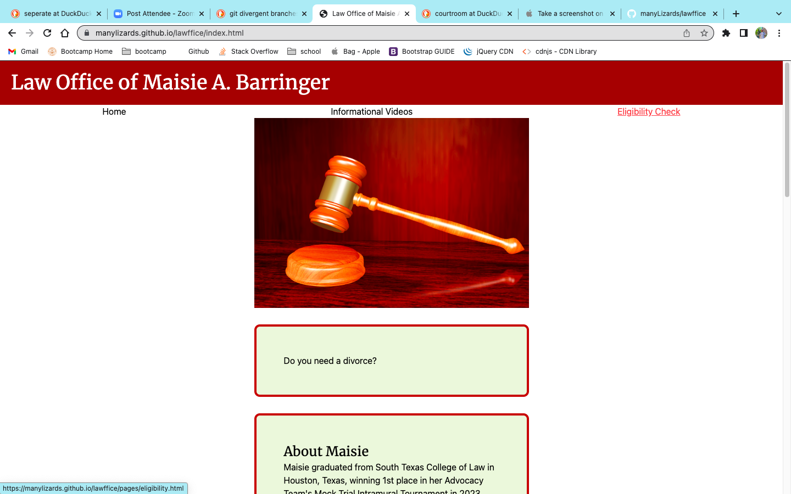
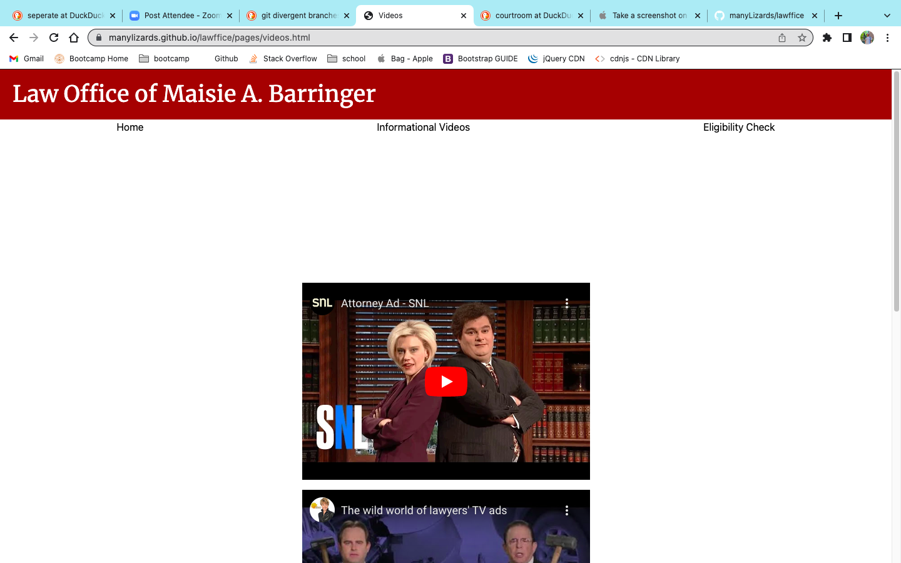
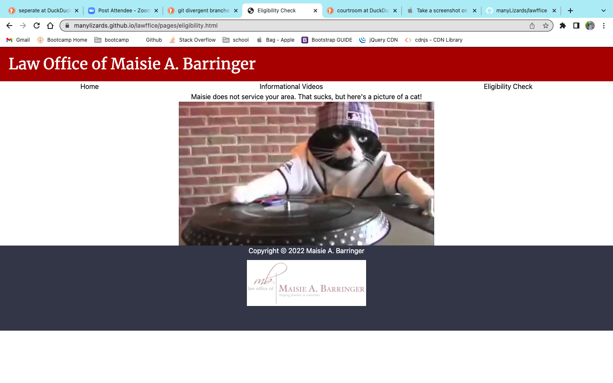

# Project 1 - Lawffice website

## Legal Services

- What was your motivation?

When we started brainstorming for this project, Jordan asked if we wanted to create a front-end application for her mother's legal practice.
We thought it would be a great, real-world example to code so we went started designing and planning. Ms. Barringer wanted a clean website that emphasized client interaction and provided a list of the services she offers. That being said, there are some parts of this build that act as placeholders for later builds (like the lawyer videos and generic client reviews). In the future, our team can come back to this project and properly implement some of the features that we originally planned to include, like a Google Maps API and a document submisison form, which would allow Ms. Barringer's clients to upload important documents straight to her dropbox.

- What problem does it solve?

Our client, Ms. Barringer, has thought about pursuing a career as a personal attorney seperate from her current law firm. The web application we created allows her to begin her new career on the right foot -- with a solid digital foundation and plenty of functionality to assist her new practice as it continues to grow.

- What did you learn?

 - Git --> and a whole lot of it! Git Reset, Git Stash, Git config pull.rebase false ... you name it!
 - How to work with a team
 - How to make multiple html pages function together succesfully
 - Tailwind development
 - Further API development
 - Local Storage (Divorce quiz)

## Table of Contents (Optional)

- [Installation](#installation)
- [Usage](#usage)
- [Credits](#credits)
- [License](#license)

## Installation

No installation neccesary!

Click this link: https://manylizards.github.io/lawffice/index.html

## Credits (in no particular order)

Jordan Baringer (https://github.com/manyLizards)

Norma Rivera (https://github.com/pnam412)

Troy Sparks (https://github.com/iskry)

Seth Daulton (https://github.com/sethdaulton)

John Mitchell Wood (https://github.com/mitchell4563)

Toliver Crisp (https://github.com/tolivercrisp)

# Screenshot

## License

MIT License

Copyright (c) 2022 Jordan

Permission is hereby granted, free of charge, to any person obtaining a copy
of this software and associated documentation files (the "Software"), to deal
in the Software without restriction, including without limitation the rights
to use, copy, modify, merge, publish, distribute, sublicense, and/or sell
copies of the Software, and to permit persons to whom the Software is
furnished to do so, subject to the following conditions:

The above copyright notice and this permission notice shall be included in all
copies or substantial portions of the Software.

THE SOFTWARE IS PROVIDED "AS IS", WITHOUT WARRANTY OF ANY KIND, EXPRESS OR
IMPLIED, INCLUDING BUT NOT LIMITED TO THE WARRANTIES OF MERCHANTABILITY,
FITNESS FOR A PARTICULAR PURPOSE AND NONINFRINGEMENT. IN NO EVENT SHALL THE
AUTHORS OR COPYRIGHT HOLDERS BE LIABLE FOR ANY CLAIM, DAMAGES OR OTHER
LIABILITY, WHETHER IN AN ACTION OF CONTRACT, TORT OR OTHERWISE, ARISING FROM,
OUT OF OR IN CONNECTION WITH THE SOFTWARE OR THE USE OR OTHER DEALINGS IN THE
SOFTWARE.

## Features

- Cat API
- Divorce Quiz
- Using Geolocation to see if the user is in Texas

